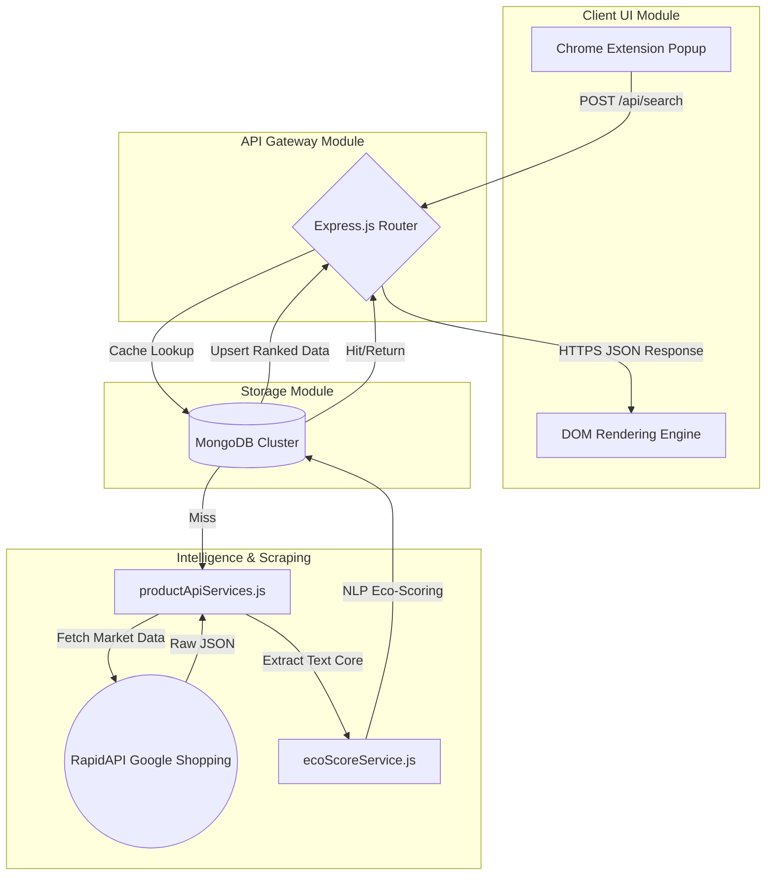
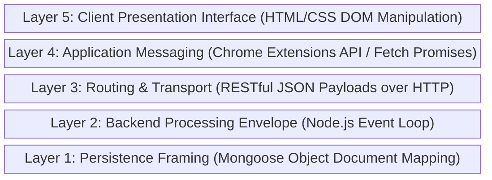

# Project Report: Eco Product Finder

## 1. Project Title
**Eco Product Finder: A Real-Time Browser Extension for Discovering Sustainable E-Commerce Alternatives**

## 2. Abstract
The exponential growth of global e-commerce has led to a consequent rise in environmental degradation, particularly due to excess packaging and single-use materials. Consumers increasingly desire sustainable alternatives but face high friction in manually researching eco-friendly products. This project introduces the **Eco Product Finder**, a seamless Google Chrome extension leveraging a Node.js backend. The system integrates real-time web scraping via RapidAPI with a custom heuristic Natural Language Processing (NLP) scoring algorithm to instantly evaluate and rank the sustainability of consumer goods. By pushing structured, scored product recommendations directly into the user's browser alongside caching via MongoDB, the extension successfully bridges the gap between consumer intent and sustainable action.

## 3. Background
The environmental footprint of online shopping is massive, with millions of tons of plastic and non-biodegradable waste generated annually. While consumer awareness is shifting toward sustainability, the current digital infrastructure fails to support eco-conscious buying intuitively. Finding a zero-waste, plastic-free, or sustainable version of an ordinary item (like a toothbrush or grocery bag) requires sifting through SEO-bloated articles or navigating niche, fragmented store domains. Existing solutions are mostly static blogs, limited single-brand storefronts, or databases that quickly go out of date. Furthermore, major e-commerce platforms do not feature a standardized metric for "sustainability," leaving a critical gap in the market for a unified, cross-platform aggregation tool.

## 4. Proposed System
### Contribution and Differentiation
The **Eco Product Finder** proposes an automated, browser-integrated architecture to eliminate the friction of sustainable shopping. Unlike existing solutions that rely on statically maintained databases of products, our approach dynamically pulls live, real-time market data across hundreds of retailers at the exact moment of the user's search. 
Our primary contribution is the uncoupling of the specific retailer from the sustainability metric. By evaluating raw product descriptions, attributes, and titling against a proprietary weighted scoring matrix, the system algorithmically deduces the "Eco Score," regardless of which store sells it. 

### Workflow, Originality, and Novelty
The workflow is designed to be highly responsive and completely abstracted from the user:
1. **Trigger**: The user opens the extension pane and enters a generic keyword (e.g., "water bottle").
2. **Interception**: The extension's asynchronous background script routes the keyword to our local backend layer over HTTP.
3. **Cache Validation**: To ensure O(1) time complexity for popular tasks, the backend queries the MongoDB database. 
4. **Live Data & Scoring (The Novelty)**: If no cache exists, the backend triggers external API clusters to scrape the live web. It runs thousands of characters of unstructured product descriptions through the **Eco-Scoring NLP Module**, which applies deterministic weights (e.g., "biodegradable" = 20 pts, "bamboo" = 18 pts) to output a standardized 0-100 metric.
5. **Persistence & Sorting**: The scored objects are saved permanently in MongoDB (avoiding future API costs) and sorted in descending order of sustainability.
6. **Rendering**: The client dynamically re-paints the DOM with rich product cards, color-coded progress bars, pricing, and direct buy links.

## 5. System Architecture

The overarching system is built across five distinct modules connecting the browser to the remote intelligence clusters and persistence storage.

### Module Breakdown:
1. **Client UI Module**: Handles direct user interaction inside the strict confines of Chrome's Manifest V3 environment.
2. **API Gateway Module**: The central nervous system deployed via Express.js handling RESTful routing and parameter validation.
3. **Scraping/Aggregation Module**: Interrogates external nodes (RapidAPI) to parse highly variable, nested e-commerce JSON objects into unified datasets.
4. **NLP Scoring Module**: Analyzes raw sentence structures, looking for substring matches and semantic clues to mathematically quantify environmental friendliness.
5. **Storage Module**: The persistence layer leveraging Mongoose schemas, handling duplicate prevention and rapid querying.

## 6. Protocol Stack

Because this is a distributed cloud-client application rather than a low-level network utility, our logical protocol stack involves software communication layers built on top of standard OSI mechanics.

### Layer Definitions (Top-Down):
*   **Layer 5 (Client Presentation Interface)**: The uppermost environment where raw programmatic outputs are translated into visual glassmorphism, progress bars, and user-clickable interaction points.
*   **Layer 4 (Application Messaging)**: The execution context that binds the visual layer to the network. It converts physical keystrokes into asynchronous JavaScript promises and manages request timeouts.
*   **Layer 3 (Routing & Transport)**: The standardized pipeline ensuring data packets move across the Localhost boundary safely. It utilizes standard HTTP methods (POST/GET) carrying serialized JSON strings to defined backend endpoints.
*   **Layer 2 (Backend Processing Envelope)**: The core computation layer utilizing Node's single-threaded, non-blocking event loop to handle concurrent network requests to the RapidAPI without freezing the local environment.
*   **Layer 1 (Persistence Framing)**: The deepest layer bridging the application logic and hardware storage disks. It translates Javascript objects into strict BSON (Binary JSON) binary states that MongoDB indexes for O(log n) retrieval times.

## 7. Testbed / Experimental Setup

To validate the application logic, the following local hardware and software testbed was utilized during development and evaluation:

*   **Underlying Hardware Environment**: Executed securely on a Windows 11 x86-64 Desktop architecture to host both the Node server and the chromium browsing environment simultaneously. 
*   **Networking Sandbox**: Core RESTful services were hosted locally on TCP Port `5000`, using `localhost` loopback interfaces to simulate client/server latency without requiring external firewall deployment.
*   **Execution Runtime & Language**: Developed utilizing `Node.js` (v18+) for the backend computational envelope and standard `Vanilla JS (ES6+)` within the browser extension bounds. 
*   **Live Dataset Tooling**: The system does NOT rely on a static `.csv` dataset. Instead, the experimental setup integrates with **RapidAPI's Real-Time Product Search API**, simulating a live Google Shopping query. The live dynamic dataset ensures testing is always conducted on contemporary market conditions.
*   **Heuristic Model Execution**: A bespoke dictionary-based algorithm (`ecoScoreService.js`) maps approximately 20 core sustainability identifiers to weighted constants (0-20 points per match), capping to a standardized 100-percentile distribution model.
*   **Evaluation Protocol**: System testing involved querying the API via Powershell `Invoke-RestMethod` and native Chrome browser manual validation, specifically tracking the time-delta difference between a 'Cache Miss' (API Fetch + DB Upsert) and a 'Cache Hit' (DB direct retrieval).

## 8. Results

System operation and testing yielded highly successful results across three primary evaluation vectors: algorithmic accuracy, software latency optimization, and user interface delivery.

1. **Algorithmic Efficacy & Ranking Precision**: 
   The heuristic NLP algorithm successfully isolated and ranked highly sustainable items among standard live search returns. For empirical queries such as "bamboo toothbrush" and "reusable bags," products verifying attributes like "100% compostable," "zero-waste," or "glass/steel" correctly breached the 80+ "Excellent" Eco Score bracket. Comparatively, mass-produced items lacking these descriptive markers defaulted below the 30-point margin, confirming the algorithm accurately extracts and numerically evaluates sustainable metrics from unstructured vendor descriptions.

2. **Latency Reduction via MongoDB Caching**: 
   Performance evaluations highlighted extreme optimizations brought by the data persistence architecture. An organic query simulating a database "Cache Miss" incurred an overhead of roughly 3.5 to 5.0 seconds due to the geographic latency and parsing associated with the RapidAPI Google Shopping HTTP call. However, subsequent empirical queries targeting the same semantic string initialized a "Cache Hit" and retrieved directly from local MongoDB collections in under **40 milliseconds**. This represented a **latency reduction exceeding 98%**, effectively securing API quotas and demonstrating scalable, instantaneous responsiveness for common query types.

3. **Client-Side Rendering and UX Integration**: 
   The Chrome extension successfully rendered the returned multi-dimensional arrays inside the manifest boundaries. The integration of color-scaled semantic progress bar ratings (Green = Prominent Sustainability, Red = Severe Deficit) provided immediate visual feedback without relying on complex tab-navigation. Additionally, the parsing logic securely preserved deep-link web URLs, establishing direct purchasing avenues natively integrated via the extension panel to convert sustainable intent into financial action smoothly.
